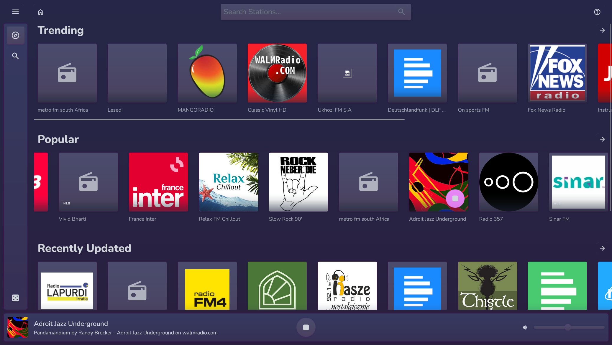
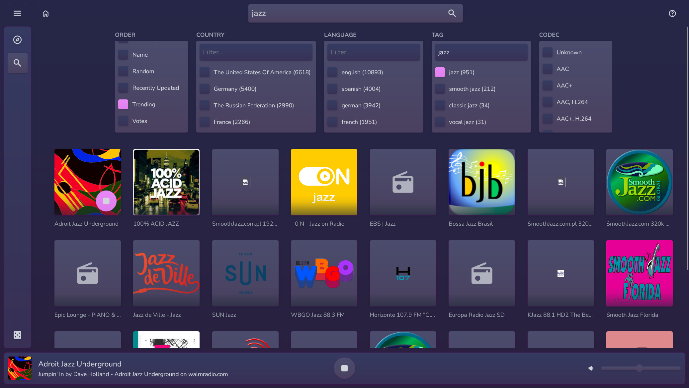
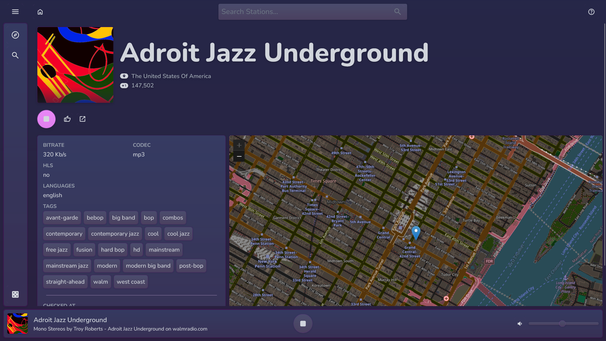

<h1 align="center">Wadio</h1>

Wadio is a music app, powered by [radio-browser](https://www.radio-browser.info/), built using Blazor WebAssembly.

## Features

- **Discover**: Explore *Trending*, *Popular*, *Recently Updated*, and *Random* stations.
- **Search**: Search for stations using a variety of criteria.
- **Station Details**: View information about stations.
- **Metadata Support**: Realtime handling of common HLS+Icecast metadata tags
- **Responsive Design**: Considerately designed for both Mobile and Desktop use
- **Standalone PWA**: "Install App"/"Add to Homescreen" with supported browsers

### <u>Discover</u>

### <u>Search</u>

### <u>Station Details</u>

